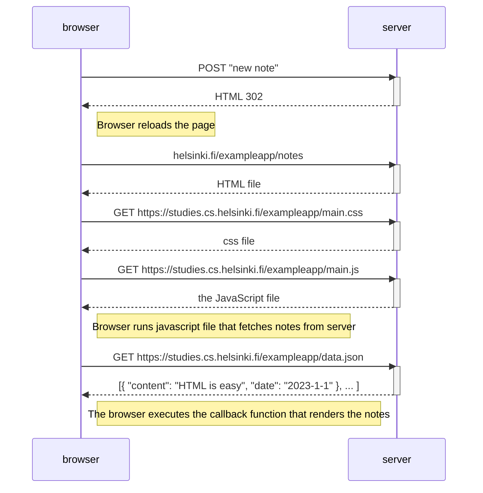

```mermaid
sequenceDiagram
    participant browser
    participant server
    
    browser->>server: POST "new note"
    activate server
    server-->>browser: HTML 302
    deactivate server
    Note right of browser: Browser reloads the page 

    browser->>server: helsinki.fi/exampleapp/notes
    activate server
    server-->>browser: HTML file
    deactivate server
    
    browser->>server: GET https://studies.cs.helsinki.fi/exampleapp/main.css
    activate server
    server-->>browser: css file
    deactivate server
    
    browser->>server: GET https://studies.cs.helsinki.fi/exampleapp/main.js
    activate server
    server-->>browser: the JavaScript file
    deactivate server
    
    Note right of browser: Browser runs javascript file that fetches notes from server
    
    browser->>server: GET https://studies.cs.helsinki.fi/exampleapp/data.json
    activate server
    server-->>browser: [{ "content": "HTML is easy", "date": "2023-1-1" }, ... ]
    deactivate server    

    Note right of browser: The browser executes the callback function that renders the notes
```