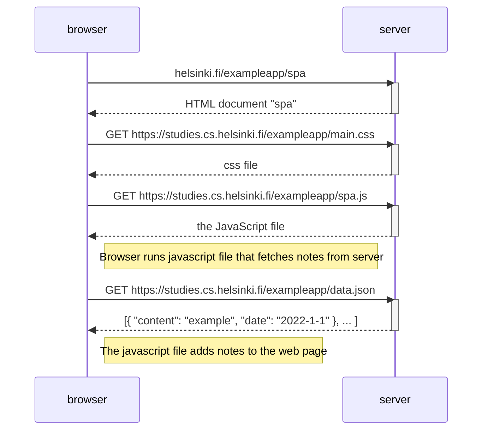

```mermaid
sequenceDiagram
    participant browser
    participant server

    browser->>server: helsinki.fi/exampleapp/spa
    activate server
    server-->>browser: HTML document "spa"
    deactivate server
    
    browser->>server: GET https://studies.cs.helsinki.fi/exampleapp/main.css
    activate server
    server-->>browser: css file
    deactivate server
    
    browser->>server: GET https://studies.cs.helsinki.fi/exampleapp/spa.js
    activate server
    server-->>browser: the JavaScript file
    deactivate server
    
    Note right of browser: Browser runs javascript file that fetches notes from server
    
    browser->>server: GET https://studies.cs.helsinki.fi/exampleapp/data.json
    activate server
    server-->>browser: [{ "content": "example", "date": "2022-1-1" }, ... ]
    deactivate server    

    Note right of browser: The javascript file adds notes to the web page
```